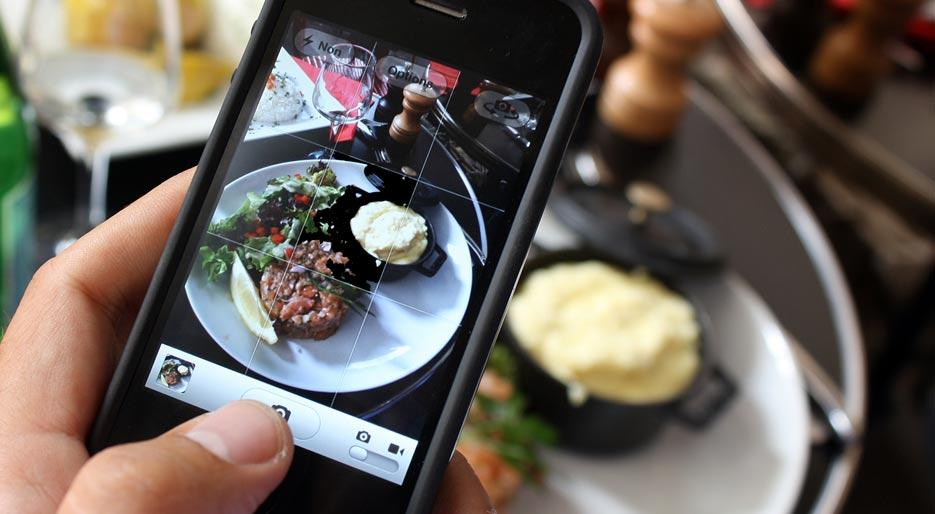

# The WDInstagram Collaborative Challenge!

## Setup

Provided here is an app with a number of features: some of them are 
totally complete, and some are partially complete.

Your job is to finish the incomplete parts and submit pull requests
(PRs) for each one. The unfinished features each have an issue 
associated with them (listed below).

***In order to work on this challenge, fork and clone your own version 
of the repo.***

## Issues

1.  (Server-side) [Implement `SHOW entry` route feature.][issue-1]
2.  (Client-side) [Implement the "like" trigger and rendering in the 
    client feature.][issue-2]
3.  (Full-stack) [Implement all of the functionality (client and server) 
    for a creating an entry feature.][issue-3]

## Specs

As usual, you will be scored on the scale of 0-3, with 2 being passing.
You recieve 1 point for each issue if:

- you completely delivered it's feature,
- you used the issue (or newly created issues) to discuss and receive
  help from your collaborators (instructors) following the 
  [issue guidelines][issues], and
- you correctly followed the [team Git workflow][workflow] associated 
  with *programmers*, including working in a feature branch, making many
  small, well-named commits, and submitting PRs correctly.

Partial points are available.

## Due

Each issue/feature will be graded when the associated *milestone* (see
the right side of the issue, under the labels) comes due, *at the 
latest*.

<!-- Links -->

[issue-1]:  https://github.com/h4w5/wdinstagram_challenge/issues/1
[issue-2]:  https://github.com/h4w5/wdinstagram_challenge/issues/5
[issue-3]:  https://github.com/h4w5/wdinstagram_challenge/issues/6
[issues]:   https://github.com/ga-students/WDI_DTLA_8/tree/master/projects/project_issues_protocol
[workflow]: https://github.com/ga-students/WDI_DTLA_8/blob/master/resources/cheatsheets/git_team_cheatsheet.md
